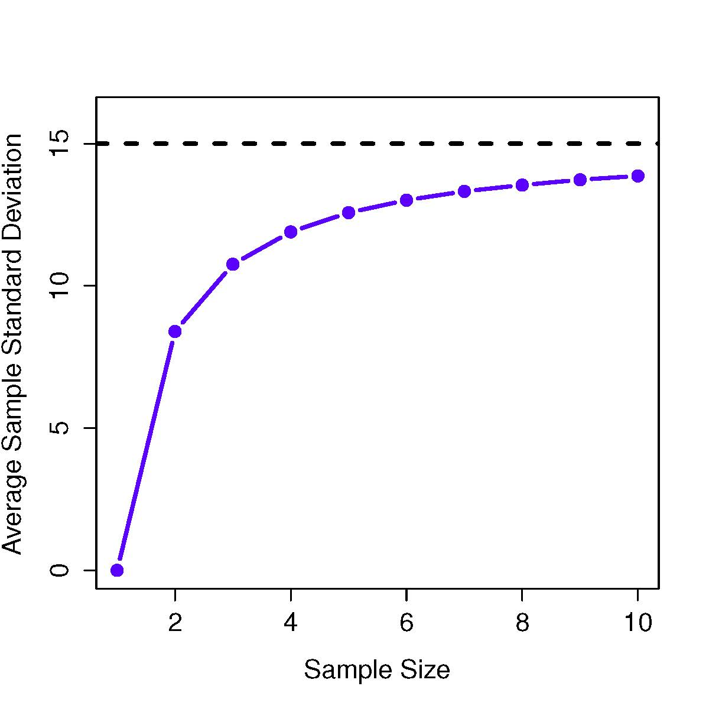

```{R, setup, include = F}
# devtools::install_github("dill/emoGG")
library(pacman)
p_load(
  broom, tidyverse,
  latex2exp, ggplot2, ggthemes, ggforce, viridis, extrafont, gridExtra,
  kableExtra, snakecase, janitor,
  data.table, dplyr, estimatr,
  lubridate, knitr, parallel,
  lfe,
  here, magrittr
)
# Define pink color
red_pink <- "#e64173"
turquoise <- "#20B2AA"
orange <- "#FFA500"
red <- "#fb6107"
blue <- "#2b59c3"
green <- "#8bb174"
grey_light <- "grey70"
grey_mid <- "grey50"
grey_dark <- "grey20"
purple <- "#6A5ACD"
slate <- "#314f4f"
# Dark slate grey: #314f4f
# Knitr options
opts_chunk$set(
  comment = "#>",
  fig.align = "center",
  fig.height = 7,
  fig.width = 10.5,
  warning = F,
  message = F
)
opts_chunk$set(dev = "svg")
options(device = function(file, width, height) {
  svg(tempfile(), width = width, height = height)
})
options(crayon.enabled = F)
options(knitr.table.format = "html")
# A blank theme for ggplot
theme_empty <- theme_bw() + theme(
  line = element_blank(),
  rect = element_blank(),
  strip.text = element_blank(),
  axis.text = element_blank(),
  plot.title = element_blank(),
  axis.title = element_blank(),
  plot.margin = structure(c(0, 0, -0.5, -1), unit = "lines", valid.unit = 3L, class = "unit"),
  legend.position = "none"
)
theme_simple <- theme_bw() + theme(
  line = element_blank(),
  panel.grid = element_blank(),
  rect = element_blank(),
  strip.text = element_blank(),
  axis.text.x = element_text(size = 18, family = "STIXGeneral"),
  axis.text.y = element_blank(),
  axis.ticks = element_blank(),
  plot.title = element_blank(),
  axis.title = element_blank(),
  # plot.margin = structure(c(0, 0, -1, -1), unit = "lines", valid.unit = 3L, class = "unit"),
  legend.position = "none"
)
theme_axes_math <- theme_void() + theme(
  text = element_text(family = "MathJax_Math"),
  axis.title = element_text(size = 22),
  axis.title.x = element_text(hjust = .95, margin = margin(0.15, 0, 0, 0, unit = "lines")),
  axis.title.y = element_text(vjust = .95, margin = margin(0, 0.15, 0, 0, unit = "lines")),
  axis.line = element_line(
    color = "grey70",
    size = 0.25,
    arrow = arrow(angle = 30, length = unit(0.15, "inches")
  )),
  plot.margin = structure(c(1, 0, 1, 0), unit = "lines", valid.unit = 3L, class = "unit"),
  legend.position = "none"
)
theme_axes_serif <- theme_void() + theme(
  text = element_text(family = "MathJax_Main"),
  axis.title = element_text(size = 22),
  axis.title.x = element_text(hjust = .95, margin = margin(0.15, 0, 0, 0, unit = "lines")),
  axis.title.y = element_text(vjust = .95, margin = margin(0, 0.15, 0, 0, unit = "lines")),
  axis.line = element_line(
    color = "grey70",
    size = 0.25,
    arrow = arrow(angle = 30, length = unit(0.15, "inches")
  )),
  plot.margin = structure(c(1, 0, 1, 0), unit = "lines", valid.unit = 3L, class = "unit"),
  legend.position = "none"
)
theme_axes <- theme_void() + theme(
  text = element_text(family = "Fira Sans Book"),
  axis.title = element_text(size = 18),
  axis.title.x = element_text(hjust = .95, margin = margin(0.15, 0, 0, 0, unit = "lines")),
  axis.title.y = element_text(vjust = .95, margin = margin(0, 0.15, 0, 0, unit = "lines")),
  axis.line = element_line(
    color = grey_light,
    size = 0.25,
    arrow = arrow(angle = 30, length = unit(0.15, "inches")
  )),
  plot.margin = structure(c(1, 0, 1, 0), unit = "lines", valid.unit = 3L, class = "unit"),
  legend.position = "none"
)
theme_set(theme_gray(base_size = 20))
# Column names for regression results
reg_columns <- c("Term", "Est.", "S.E.", "t stat.", "p-Value")
# Function for formatting p values
format_pvi <- function(pv) {
  return(ifelse(
    pv < 0.0001,
    "<0.0001",
    round(pv, 4) %>% format(scientific = F)
  ))
}
format_pv <- function(pvs) lapply(X = pvs, FUN = format_pvi) %>% unlist()
# Tidy regression results table
tidy_table <- function(x, terms, highlight_row = 1, highlight_color = "black", highlight_bold = T, digits = c(NA, 3, 3, 2, 5), title = NULL) {
  x %>%
    tidy() %>%
    select(1:5) %>%
    mutate(
      term = terms,
      p.value = p.value %>% format_pv()
    ) %>%
    kable(
      col.names = reg_columns,
      escape = F,
      digits = digits,
      caption = title
    ) %>%
    kable_styling(font_size = 20) %>%
    row_spec(1:nrow(tidy(x)), background = "white") %>%
    row_spec(highlight_row, bold = highlight_bold, color = highlight_color)
}
```

```{css, echo = F, eval = F}
@media print {
  .has-continuation {
    display: block !important;
  }
}
```


class: inverse, middle
# PREGLED PREDAVANJA

---
layout: true
# PREGLED PREDAVANJA
---
<br>
<br>

## CILJEVI 
<br>
<br>


- Uzorak vs. Populacija
- Procjena prosjeka i standardne devijacije populacije
- Sampling distribucije
- Intervali pouzdanosti

---

layout:false
class: middle, inverse
# UZORAK vs POPULACIJA 
<html><div style='float:left'></div><hr color='#EB811B' size=1px width=796px></html>
(Drveće vs šuma!)
---

layout:true
# UZORAK vs POPULACIJA 


---
<br>
<br>

- Jednostavni slučajni uzorak
<br>
- Jednostavni slučajni uzorak sa *zamjenom* i *bez zamjene*
<br>
- Da li je naš uzorak uistinu slučajan?!
<br>
- Koliko je bitno da imamo "slučajni uzorak"?
<br>
- Želimo naučiti nešto o populaciji no imamo samo uzorak!

---
<br>
<br>

.hi[Stvori uzorak od 10.000 ljudi iz populacije sa prosječnim IQ od 100 i standardnom devijacijom 15]
<br>
<br>

```{r}
IQ <- rnorm(n = 10000, mean = 100, sd = 15) # Stvori seriju IQ bodova
IQ <- round(IQ) # IQ je cijeli broj
print(head(IQ),7) # Pogledaj podatke

```

--

```{r}
mean(IQ)        # Provjeri prosjek
sd(IQ)          # Provjeri standardnu devijaciju
```

---
.hi[Grafički prikaz populacije]

```{r IQdis, fig.cap="", echo=F,eval=F, warning = FALSE, message=FALSE }
estImg <- list()
emphCol <- rgb(0,0,1)
emphColLight <- rgb(.5,.5,1)
emphGrey <- grey(.5)
colour <- TRUE
	width <- 4.5
	height <- 4.5
	
```	

```{r IQdist, fig.cap="", echo=T,eval=F, warning = FALSE, message=FALSE }
	# plot
	x <- 60:140
	y <- dnorm(x,100,15)
	plot(x,
	     y,
	     lwd=3,
	     type="l",
	     col=ifelse(colour,emphCol,"black"),
	     xlab="IQ Bodovi",
	     ylab="Gustoća vjerojatnosti",
       frame.plot=FALSE,
	     title = ""
	)

```	

---

.hi[Grafički prikaz populacije]

```{r IQdistg, fig.cap="", echo=F,eval=T, warning = FALSE, message=FALSE, fig.height=4 }
estImg <- list()
emphCol <- rgb(0,0,1)
emphColLight <- rgb(.5,.5,1)
emphGrey <- grey(.5)
colour <- TRUE
	width <- 4.5
	height <- 4.5
	
	# plot
	x <- 60:140
	y <- dnorm(x,100,15)
	plot(x,
	     y,
	     lwd=3,
	     type="l",
	     col=ifelse(colour,emphCol,"black"),
	     xlab="IQ Bodovi",
	     ylab="Gustoća vjerojatnosti",
       frame.plot=FALSE,
	     title = ""
	)

```	


.footnote[[*]Grafikon prikazuje distribuciju IQ u populaciji.]

---

.hi[Grafički prikaz uzorka]

```{r echo=T, eval=F}
	# funkcija za izradu grafikona
	plotSamples <- function( n ) {
		
		IQ <- rnorm(n, 100, 15)
		hist( IQ,
		      breaks=seq(10,180,5),
		      border="white",
		      col=ifelse(colour,emphColLight,emphGrey),
		    	xlab="IQ Bodovi",
		    	ylab="Frekvencija",
		    	xlim=c(60,140),
		    	main=""
			
		)
		
		print( paste( "n=",n,"prosjek=",mean(IQ), "sd=",sd(IQ) ) ) # Prikaži deskriptivnu statistiku
	}
```

```{r echo=F, eval=T}
	# funkcija za izradu grafikona
	plotSamples <- function( n ) {
		
		IQ <- rnorm(n, 100, 15)
		hist( IQ,
		      breaks=seq(10,180,5),
		      border="white",
		      col=ifelse(colour,emphColLight,emphGrey),
		    	xlab="IQ Bodovi",
		    	ylab="Frekvencija",
		    	xlim=c(60,140),
		    	main=""
			
		)
		
		print( paste( "n=",n,"prosjek=",mean(IQ), "sd=",sd(IQ) ) ) # Prikaži deskriptivnu statistiku
	}
```
---

.hi[Uzorci različite veličine (N=100)]

```{r echo=T,eval=T, fig.height=4, fig.width=5}
# prikaži
	plotSamples(100)
```


---

.hi[Uzorci različite veličine (N=10.000)]

```{r echo=T,eval=T, fig.height=4, fig.width=5}
# prikaži
	plotSamples(10000)
```


---
layout:false
class: middle, inverse
# PROCJENA PROSJEKA I STANDARDNE DEVIJACIJE POPULACIJE 
<html><div style='float:left'></div><hr color='#EB811B' size=1px width=796px></html>
(Zaključivanje o populaciji na osnovi uzorka?)
---

layout:true
# PROCJENA PROSJEKA I STANDARDNE DEVIJACIJE POPULACIJE 

---

.hi[Notacija i značenje]
<br>
<br>

```{r, echo=FALSE}
knitr::kable(data.frame(stringsAsFactors=FALSE,
                   Simbol = c("$\\bar{X}$", "$\\mu$", "$\\hat{\\mu}$"),
              Znacenje = c("Prosjek uzorka", "Prosjek populacije ",
                              "Procjena prosjeka populacije"),
   Dodatno = c("Izračunato na podatcima",
                              "Uglavnom nepoznato",
                              "Jednako prosjeku uzorka")))
```
---

.hi[**Nepristranost prosjeka**]


```{r estimatorbias, echo=F, out.height="50%", fig.height=1, out.width="50%", fig.align='center'}
knitr::include_graphics("biasMean.png")

```

---

.hi[**Pristranost standardne devijacije**]
<br>

- Kako povećavamo veličinu uzorka, *standardna devijacija* je sve manja!
$$
s^2 = \frac{1}{N} \sum_{i=1}^N (X_i - \bar{X})^2
$$

- Procjenu standardne devijacije populacije je potrebno korigirati:
$$
\hat\sigma^2 = \frac{1}{N-1} \sum_{i=1}^N (X_i - \bar{X})^2 
$$

- Procijenjena standardna devijacija populacije:
$$
\hat\sigma = \sqrt{\frac{1}{N-1} \sum_{i=1}^N (X_i - \bar{X})^2} 
$$

---

.hi[**Pristranost standardne devijacije**]

````{r biasSD, echo=F, out.height="50%", fig.height=1, out.width="50%", fig.align='center'}


```


---

.hi[Još notacije...]

```{r echo=FALSE}
knitr::kable(data.frame(stringsAsFactors=FALSE,
                   Simbol = c("$s$", "$\\sigma$", "$\\hat{\\sigma}$", "$s^2$",
                              "$\\sigma^2$", "$\\hat{\\sigma}^2$"),
             Znacenje = c("Standardna devijacija uzorka",
                              "Standardna devijacija populacije",
                              "Procjena standardne devijacije populacije", "Varijanca uzorka",
                              "Varijanca populacije",
                              "Procjena varijance populacije"),
   Dodatno= c("Na osnovi podataka",
                              "Uglavnom nepozato",
                              "Slično kao standardna devijacija uzorka",
                              "Na osnovi podataka",
                              "Uglavnom nepozato",
                              "Slično kao varijanca uzorka")
))
```


---
layout:false
class: middle, inverse
# SAMPLING DISTRIBUCIJE 
<html><div style='float:left'></div><hr color='#EB811B' size=1px width=796px></html>
(Svojstva distribucija uzoraka...)
---

layout:true
# SAMPLING DISTRIBUCIJE

---

.hi[Primjer: Deset ponavljanja IQ eksperimenta, svaki sa veličinom uzorka $N=5$.]

```{r replications, echo=FALSE}
knitr::kable(data.frame(stringsAsFactors=FALSE,
Ponavljanje = c("Ponavljanje 1", "Ponavljanje 2", "Ponavljanje 3", "Ponavljanje 4",
         "Ponavljanje 5", "Ponavljanje 6", "Ponavljanje 7", "Ponavljanje 8",
         "Ponavljanje 9", "Ponavljanje 10"),
Osoba.1 = c(90, 78, 111, 98, 105, 81, 100, 107, 86, 95),
Osoba.2 = c(82, 88, 122, 96, 113, 89, 93, 100, 119, 126),
Osoba.3 = c(94, 111, 91, 119, 103, 93, 108, 105, 108, 112),
Osoba.4 = c(99, 111, 98, 99, 103, 85, 98, 117, 73, 120),
Osoba.5 = c(110, 117, 86, 107, 98, 114, 133, 85, 116, 76),
Prosjek.uzorka = c(95, 101, 101.6, 103.8, 104.4, 92.4, 106.4, 102.8, 100.4,
                  105.8))
)
```

---

.hi[Funkcija za generiranje sampling distribucija]

```{r IQsampa, fig.cap="", echo=T}
  width <- 4.5
	height <- 4.5
	
	# definiraj funkciju
	plotSamples <- function( n, N) {
		
		IQ <- rnorm(n, 100,15/sqrt(N))
		hist( IQ, breaks=seq(10,180,5), border="white", freq=FALSE,
			col=ifelse(colour,emphColLight,emphGrey),
			xlab="IQ Bodovi", ylab="", xlim=c(60,140),
			main=paste("Veličina uzorka =",N), axes=FALSE,
			font.main=1, ylim=c(0,.07)
		)
		axis(1)
	}
	
	# distribucija populacije
	x <- 60:140
	y <- dnorm(x,100,15)

```

---

```{r fig.height=4, fig.width=5}
	
	# prikaz različitih veličina uzoraka
	plotSamples(10000,1)
	lines(x,y,lwd=2,col="black",type="l")
```


.footnote[[*]Svaki uzorak se satoji od samo jedne opservacije tako da je prosijek svakog uzorka samo IQ jedne osobe. Zbog toga je sampling distribucija prosjeka jednaka distribuciji IQ bodova.]

---


```{r IQsampb, fig.cap="", echo=FALSE, fig.height=4, fig.width=5}
width <- 4.5
	height <- 4.5
	# prikaz različitih veličina uzoraka
	plotSamples(1000,2)
	lines(x,y,lwd=2,col="black",type="l")
```

.footnote[[*]Kada povećamo uzorak, prosjek svakog uzorka konvergira prosjeku populacije znatno više nego u slučaju samo jedne osobe. Histogram je zbog toga malo uži nego u populaciji.]

---

```{r IQsampc, fig.cap="", echo=FALSE,fig.height=4, fig.width=5}
width <- 4.5
	height <- 4.5
	# prikaz različitih veličina uzoraka
	plotSamples(1000,10)
	lines(x,y,lwd=2,col="black",type="l")
```

.footnote[[*]Kod veličline uzoprka od 10 se može primijetiti da je distribucija prosjeka uzoraka centrirana blizu pravog prosjeka populacije.]


---
layout:false
class: middle, inverse
# TEOREM CENTRALNE TENDENCIJE 
<html><div style='float:left'></div><hr color='#EB811B' size=1px width=796px></html>
(Gravitacija!)
---

layout:true
# TEOREM CENTRALNE TENDENCIJE 

---
<br>
<br>
- Zakon velikih brojeva
<br>
<br>
- Standardna devijacija sampling distribucije

$$
\mbox{SEM} = \frac{\sigma}{ \sqrt{N} }
$$


---

.hi[Grafički prikaz] 

```{r cltdemo1, fig.cap="", echo = F, eval=T, fig.height=3}
	# needed for printing
	width <- 6
	height <- 6	
	
	# parameters of the beta
	a <- 2
	b <- 1
	
	# mean and standard deviation of the beta
	s <- sqrt( a*b / (a+b)^2 / (a+b+1) )
	m <- a / (a+b)
	
	# define function to draw a plot
	plotOne <- function(n,N=50000) {
		
		# generate N random sample means of size n
		X <- matrix(rbeta(n*N,a,b),n,N)
		X <- colMeans(X)
		
		# plot the data
		hist( X, breaks=seq(0,1,.025), border="red", freq=FALSE,
			xlab="Prosjek uzorka", ylab="", xlim=c(0,1.2),
			main=paste("Veličina uzorka =",n), axes=FALSE,
			font.main=1, ylim=c(0,5)
		)
		box()
		axis(1)
		#axis(2)
		
		# plot the theoretical distribution
		lines( x <- seq(0,1.2,.01), dnorm(x,m,s/sqrt(n)), 
			lwd=2, col="black", type="l"
		)
	}
	
```
	
		
```{r cltdemo, fig.cap="", echo = F, eval=T, fig.height=4}	
		plotOne(1)
```

.footnote[[*]Grafički prikaz teorema centralne tendencije. Grafikon pokazuje ne-standardnu distribuciju (populacije).
---

.hi[Grafički prikaz]

```{r cltdemwo, fig.cap="", echo = F, eval=T, fig.height=4}	
		plotOne(2)
```


.footnote[[*]Grafički prikaz teorema centralne tendencije. Grafikoni prikazuju sampling distribuciju prosjeka za uzorke veličine 2,4 and 8, stvorenih na osnovi podataka iz ne-standardne distribucije (prethodni grafikon). Iako je originalna populacija ne-standardno distribuirana, sampling distribucija prosjeka konvergira standardnoj distribuciji.]
---

.hi[Grafički prikaz (N=4)]

```{r cltdemtro12, fig.cap="", echo = F, eval=T, fig.height=4}	
		plotOne(4)
```

---

.hi[Grafički prikaz (N=8)]

```{r cltdemtro21, fig.cap="", echo = F, eval=T, fig.height=4}	
		plotOne(8)
```


---
layout:false
class: middle, inverse
# INTERVALI POUZDANOSTI 
<html><div style='float:left'></div><hr color='#EB811B' size=1px width=796px></html>
(Procjena sigurnosti statističkih rezultata!)
---

layout:true
# INTERVALI POUZDANOSTI

---
<br>
<br>
.hi[Izračunaj 95% standardne distribucije]

```{r}
# percentili (2.5% i 97.5%) standardne distribucije
qnorm( p = c(.025, .975) )
``` 

---
<br>
<br>
.hi[Interval pouzdanosti za prosjek kada su parametri populacije poznati] <br>
<br>
$$
\mu - \left( 1.96 \times \mbox{SEM} \right) \ \leq \  \bar{X}\  \leq \  \mu + \left( 1.96 \times \mbox{SEM} \right) 
$$

---
<br>
<br>
.hi[Intervali pouzdanosti za prosjek populacije]
<br>
<br>
$$
\bar{X} -  \left( 1.96 \times \mbox{SEM} \right) \ \leq \ \mu  \ \leq  \ \bar{X} +  \left( 1.96 \times \mbox{SEM}\right)
$$
---

.hi[Standardni zapis]

$$
\mbox{CI}_{95} = \bar{X} \pm \left( 1.96 \times \frac{\sigma}{\sqrt{N}} \right)
$$


---
<br>
<br>
.hi[Kada prosjek i stdev nisu poznati, koristi se t distribucija]
<br>
<br>
```{r}
N <- 10000   # Veličina uzorka 10,000
qt( p = .975, df = N-1)   # Izračunaj 97.5th percentil t distribucije
```

```{r}
N <- 10  # Veličina uzorka 10
qt( p = .975, df = N-1)   # Izračunaj 97.5th percentil t distribucije
```

---

.hi[Izračunaj interval pouzdanosti u R]

```{r}
# ciMean( x = afl$attendance )
#    2.5%    97.5% 
# 31597.32 32593.12 
```


---

.hi[Grafički prikaži intervale pouzdanosti]


```{r warning = FALSE, message = FALSE}
load( file.path( "../Podatci/afl24.Rdata" ))  # Učitaj podatke
library( sciplot )     # Paketi za bargraph.CI() i lineplot.CI() funkicje
library( lsr )         # ciMean() funkcija
```


```{r bargraphCI, fig.cap="", echo = T, eval=F, fig.height=4, fig.width=5}
bargraph.CI( x.factor = year,             # Grupirajuća varijabla 
              response = attendance,      # Ciljana varijabla
              data = afl,                 # Podatci
              ci.fun = ciMean,             # Naziv funkcije za izračun CI
              xlab = "Godina",              
              ylab = "Prosječna posjećenost" 
 )
```

---
```{r bargraphCIgg, fig.cap="", echo = F, eval=T, fig.height=4, fig.width=5}
bargraph.CI( x.factor = year,             # Grupirajuća varijabla 
              response = attendance,      # Ciljana varijabla
              data = afl,                 # Podatci
              ci.fun = ciMean,             # Naziv funkcije za izračun CI
              xlab = "Godina",              
              ylab = "Prosječna posjećenost" 
 )
```

.footnote[[*]Prosjeci i 95% interval pouzdanosti za posjećenost AFL utakmica`, prikazani za svaku godinu od 1987 do 2010.]

---

.hi[Grafički prikaži intervale pouzdanosti]


```{r lineplotCIgdz, fig.cap = "", echo = T, eval=F, fig.height=4, fig.width=5}
lineplot.CI( x.factor = year,            # Grupirajuća varijabla  
             response = attendance,      # Ciljana varijabla
             data = afl,                 # Podatci
             ci.fun = ciMean,             # Naziv funkcije za izračun CI
             xlab = "Godina",              
             ylab = "Prosječna posjećenost" 
)
```


---

.hi[Grafički prikaži intervale pouzdanosti]

```{r lineplotCIgd, fig.cap = "", echo = F, eval=T, fig.height=4, fig.width=5}
lineplot.CI( x.factor = year,            # Grupirajuća varijabla  
             response = attendance,      # Ciljana varijabla
             data = afl,                 # Podatci
             ci.fun = ciMean,             # Naziv funkcije za izračun CI
             xlab = "Godina",              
             ylab = "Prosječna posjećenost" 
)
```

.footnote[[*]Prosjeci i 95% interval pouzdanosti za posjećenost AFL utakmica`, prikazani za svaku godinu od 1987 do 2010.]


---

layout:false
class: middle, inverse
# HVALA NA PAŽNJI! 
<html><div style='float:left'></div><hr color='#EB811B' size=1px width=796px></html>
(Sljedeće predavanje: Testirnje statističkih hipoteza!)

