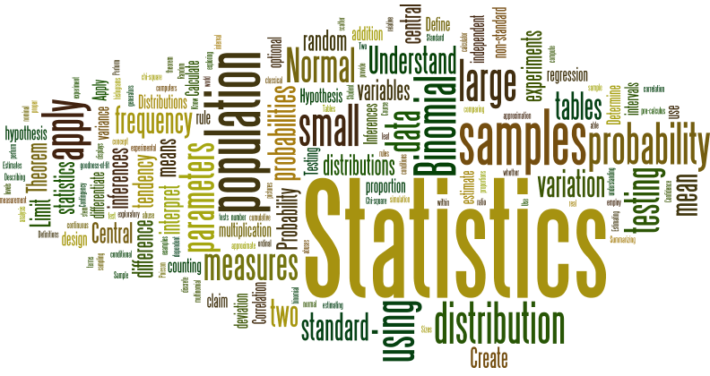

  

 

 

# Primjena statistike u društvenim istraživanjima

Dobrodošli na stranice kolegija <b>Primjena statistike u društvenim istraživanjima</b> koji u zimskom semestru, 2020/21 izvodi [Luka Šikić](https://www.lukasikic.info/), PhD na Fakultetu hrvatskih studija u Zagrebu. Kolegij je prvenstveno namijenjen studentima sociologije na preddiplomskoj razini, a može koristiti svim studentima društvenih i humanističkih smjerova koji su upoznati sa osnovama statistike.

U kolegiju se obrađuju osnove statistike organizirane u tri cjeline:
1. deskriptivna statistika i vizualizacija
2. statistička teorija
3. inferencijalna statistika *(statistički modeli)*.

Primjenjeni aspekt kolegija odnosi na provedbu statističkih koncepata u [programskom jeziku R](https://www.r-project.org/). Pri tome je naglasak na osnovnoj `base::` sintaksi programskog jezika R, a manje na korištenju specifičnih paketa.  

Cilj kolegija je dvojak: 1) utvrđivanje osnovnih statističkih koncepata, 2) osposobljavanje za rad s podatcima i samostalnu provedbu statističke analize. Pri tome je veći naglasak stavljen na praktičnu primjenu statističkih koncepata nego na statističku teoriju. Kolegij ne zahtjeva prethodno poznavanje programskog jezika R no najveću će korist ostvariti studenti koji materijale (ili dio) prate u kroz jezik R. Studentima se preporuča instalacija [Git](https://git-scm.com/)-a i doprinos kolegiju kroz [GitHub](https://github.com/) (primjerice kroz ispravke grešaka ili poboljšanje materijala...). Materijali u ovom repozitoriju su napravljeni po [Open Source](https://opensource.org/) principima.

Kolegij će studentima društvenih znanosti omogućiti uključivanje u modernu paradigmu rada sa podatcima i otvoriti perspektivu rada sa [Data Science](https://www.edureka.co/blog/what-is-data-science/) i [Big Data](https://www.oracle.com/big-data/what-is-big-data.html) tehnologijama. Na taj način kolegij studentima otvara priliku [produbljenja akademskih vještina](https://www.thebritishacademy.ac.uk/documents/206/Society-Counts-Quantitative-Skills-in-the-Social-Sciences-Humanities-Position-_3xJi9mM.pdf) (*provedba kvantitativne empirijske analize*), povećava [mogućnosti zaposlenja](https://studyonline.unsw.edu.au/blog/data-science-degree-jobs) (*na strani analitike ili pojektnog IT menadzmenta*) i doprinosi smanjenju STEM jaza. 

# Raspored

<b>Predavanja</b>&nbsp;&nbsp;&nbsp;&nbsp;&nbsp;Ponedjeljkom,&nbsp;16:00–17:30
 <b>Vježbe</b>&nbsp;&nbsp;&nbsp;&nbsp;&nbsp;&nbsp;&nbsp;&nbsp;&nbsp;&nbsp;&nbsp;&nbsp;Ponedjeljkom,&nbsp;17:30–19:00
 <b>Konzultacije</b>&nbsp;&nbsp;&nbsp;Četvrtkom,&nbsp;&nbsp;&nbsp;&nbsp;&nbsp;&nbsp;17:30-18:30

# Knjige

Koristiti ćemo tri knjige.

<a href="https://www.fon.hum.uva.nl/paul/lot2015/Navarro2014.pdf">Learning statistics with R (LSR)</a>
 <i>od Danielle Navarro.</i> 
 Ovo je glavna literatura. <a href = "https://learningstatisticswithr.com/">Pogledajte</a> i dodatne materijale koji prate knjigu. Dostupna je i <a href="https://learningstatisticswithr.com/book/">bookdown</a> verzija.

<a href="https://www.superknjizara.hr/?page=knjiga&id_knjiga=90301">Osnovne statističke metode za nematematičare</a>
 <i>od Boris Petz.</i> 
 Ovo je također glavna literatura i preporuča se studentima koji ne polože ispit preko kolokvija.

<a href="http://daviddalpiaz.github.io/appliedstats/applied_statistics.pdf">Applied Statistics with R</a>
 <i>od David Dalpiaz.</i> 
 Ovo je dodatna literatura za one koji žele znati više. Dostupna je i <a href="http://daviddalpiaz.github.io/appliedstats/">bookdown</a> verzija.
    
# Materijali sa predavanja

<i>Napomena:</i> Predavanja će biti dostupna kao .pdf,.html i .Rmd.

<a href="/Moduli/01_UVOD.pdf">Predavanje 01: Pregled kolegija i studentskih obveza</a>

<a href="https://raw.githack.com/BrbanMiro/Statistika/main/Moduli/02_UVOD_U_R.pdf">Predavanje 02: Uvod u R</a> (+ <a href="https://raw.githack.com/BrbanMiro/Statistika/main/Moduli/02_DODATNI_KONCEPTI_R.pdf">Dodatni koncepti R</a>)

<ul>
<li> Radni prostor</li>
<li> Osnovne naredbe</li>
<li> Funkcije</li>
<li> Vektori</li>
<li> Logički operatori</li>
<ul>

<b>Format predavanja:</b> <a href="/Moduli/02_UVOD_U_R.html">.html</a> | <a href="/Moduli/02_UVOD_U_R.pdf">.pdf</a> | <a href="/Predavanja/02_UVOD_U_R.Rmd">.Rmd</a> (+ Dodatni koncepti R: <a href="/Predavanja/02_DODATNI_KONCEPTI_R.html">.html</a> | <a href="/Moduli/02_DODATNI_KONCEPTI_R.pdf">.pdf</a> | <a href="/Moduli/02_DODATNI_KONCEPTI_R.Rmd">.Rmd</a>)
 <b>Čitanje: </b><a href="https://www.srce.unizg.hr/files/srce/docs/edu/R/s720_polaznik.pdf">Uvod u R - skripta I</a> + </b><a href="https://cran.r-project.org/doc/contrib/Kasum+Legovic-UvodUr.pdf">Uvod u R - skripta II</a> + </b><a href="https://learningstatisticswithr.com/lsr-0.6.pdf">LSR, poglavlja 3 i 4</a>

<a href="https://raw.githack.com/BrbanMiro/Statistika/main/Moduli/03_DESKRIPTIVNA_STATISTIKA_xar.html">Predavanje 03: Deskriptivna statistika</a>

<ul>
<li> Podatci</li>
<li> Mjere centralne tendencije</li>
<li> Mjere varijabilnosti</li>
<li> Mjere asimetrije i zaobljenosti</li>
<li> Pregled varijabli i skupova podataka</li>
<li> Standardizirane vrijednostii</li>
<li> Korelacija</li>
<ul>

<b>Format predavanja:</b>  <a href="/Moduli/03_DESKRIPTIVNA_STATISTIKA_xar.html">.html</a> | <a href="/Moduli/03_DESKRIPTIVNA_STATISTIKA_xar.Rmd">.Rmd</a>
 <b>Čitanje: </b><a href="https://learningstatisticswithr.com/lsr-0.6.pdf">LSR,poglavlje 5.</a>

<a href="https://raw.githack.com/BrbanMiro/Statistika/main/Moduli/04_GRAFIKONI_I_VIZUALIZACIJE_xar.html">Predavanje 04: Vizualizacija podataka</a> + <a href="https://raw.githack.com/BrbanMiro/Statistika/main/Moduli/04_GRAFIKONI_I_VIZUALIZACIJE_DODATNO_xar.html">Dodatno(ggplot2)</a>

<ul>
<li> Vizualizacija, alati i podrška </li>
<li> Izrada jednostavnog grafikona</li>
<li> Histogram</li>
<li> Box-plot</li>
<li> Prikaz korelacije</li>
<li> Dijagram rasipanja</li>
<li> Stupčasti grafikon</li>
<ul>

<b>Format predavanja:</b> <a href="/Moduli/04_GRAFIKONI_I_VIZUALIZACIJE_xar.html">.html</a> | <a href="/Moduli/04_GRAFIKONI_I_VIZUALIZACIJE_xar.Rmd">.Rmd</a>
 <b>Čitanje: </b><a href="https://learningstatisticswithr.com/lsr-0.6.pdf">LSR,poglavlje 6.</a>

<a href="https://raw.githack.com/BrbanMiro/Statistika/main/Moduli/05_VJEROJATNOST.html">Predavanje 05: Distribucije</a>

<ul>
<li> Deskriptivna vs. inferencijalna statistika</li>
<li> Binomna distribucija</li>
<li> Standardna distribucija</li>
<li> Druge često korištene distribucije</li>
<ul>

<b>Format predavanja:</b> <a href="/Moduli/05_VJEROJATNOST.html">.html</a> | <a href="/Moduli/05_VJEROJATNOST..Rmd">.Rmd</a>
 <b>Čitanje: </b><a href="https://learningstatisticswithr.com/lsr-0.6.pdf">LSR,poglavlje 9.</a>

<a href="https://raw.githack.com/BrbanMiro/Statistika/main/Moduli/06_UZORAK_POPULACIJA.html">Predavanje 06: Uzorak i populacija</a>

<ul>
<li> Uzorak i populacija</li>
<li> Procjena prosjeka i standardne devijacije populacije</li>
<li> Sampling distribucije</li>
<li> Teorem centralne tendencije</li>
<li> Intervali pouzdanosti</li>
<ul>

<b>Format predavanja:</b> <a href="/Moduli/06_UZORAK_POPULACIJA.html">.html</a> | <a href="/Moduli/06_UZORAK_POPULACIJA.Rmd">.Rmd</a>
 <b>Čitanje: </b><a href="https://learningstatisticswithr.com/lsr-0.6.pdf">LSR,poglavlje 10.</a>

<a href="https://raw.githack.com/BrbanMiro/Statistika/main/Moduli/07_HIPOTEZE.html">Predavanje 07: Testiranje hipoteza</a> 

<ul>
<li> Vrste pogrešaka</li>
<li> Testna statistika i sampling distribucija</li>
<li> Kritičke vrijednosti i granice</li>
<li> p-vrijednosti</li>
<li> Interpretacija rezultata</li>
<li> Testiranje hipoteza u R</li>
<li> Efekt veličine i snaga testa</li>
<li> Dodatni koncepti</li>
<ul>

<b>Format predavanja:</b> <a href="/Moduli/07_HIPOTEZE.html">.html</a> | <a href="/Moduli/07_HIPOTEZE.Rmd">.Rmd</a>
 <b>Čitanje: </b><a href="https://learningstatisticswithr.com/lsr-0.6.pdf">LSR,poglavlje 11.</a>

<a href="https://raw.githack.com/BrbanMiro/Statistika/main/Moduli/08_KATEGORIJALNA_ANALIZA.html">Predavanje 08: Kategorijalna analiza</a>

<ul>
<li> Goodness-of-fit test</li>
<li> Test nezavisnosti</li>
<li> Korekcija kontinuiranosti</li>
<li> Efekt veličine</li>
<li> Pretpostavke testa</li>
<li> Izvođenje chi-sq testova u R</li>
<li> Fisherov test za male uzorke</li>
<li> McNemarov test zavisnih uzoraka</li>
<ul>

<b>Format predavanja:</b> <a href="/Moduli/08_KATEGORIJALNA_ANALIZA.html">.html</a> | <a href="/Moduli/08_KATEGORIJALNA_ANALIZA.Rmd">.Rmd</a>
 <b>Čitanje: </b><a href="https://learningstatisticswithr.com/lsr-0.6.pdf">LSR,poglavlje 12.</a>

<a href="https://raw.githack.com/BrbanMiro/Statistika/main/Moduli/09_USPOREDBA_PROSJEKA.html">Predavanje 09: Usporedba prosjeka</a>

<ul>
<li> z-test</li>
<li> t-test</li>
<li> t-test u nezavisnim uzorcima</li>
<li> t-test u zavisnim uzorcima</li>
<li> Jednostrani testovi</li>
<li> Izvođenje t-testova u R</li>
<li> Efekt veličine</li>
<li> Provjera normalnosti distribucije</li>
<ul>

<b>Format predavanja:</b> <a href="/Moduli/09_USPOREDBA_PROSJEKA.html">.html</a> | <a href="/Moduli/09_USPOREDBA_PROSJEKA.Rmd">.Rmd</a>
 <b>Čitanje: </b><a href="https://learningstatisticswithr.com/lsr-0.6.pdf">LSR,poglavlje 13.</a>

<a href="https://raw.githack.com/BrbanMiro/Statistika/main/Moduli/10_ANOVA.html">Predavanje 10: ANOVA</a>

<ul>
<li> ANOVA</li>
<li> ANOVA u R</li>
<li> Efekt veličine</li>
<li> Post hoc testovi</li>
<li> Pretpostavke jednostrane ANOVA-e</li>
<li> Homogenost varijance</li>
<li> Normalnost distribucije</li>
<ul>

<b>Format predavanja:</b> <a href="/Moduli/10_ANOVA.html">.html</a> | <a href="/Moduli/10_ANOVA.Rmd">.Rmd</a>
 <b>Čitanje: </b><a href="https://learningstatisticswithr.com/lsr-0.6.pdf">LSR,poglavlje 14.</a>

<a href="https://raw.githack.com/BrbanMiro/Statistika/main/Moduli/11_REG.html">Predavanje 11: Linearna regresija</a>

<ul>
<li> Linearna regresija</li>
<li> Multivarijatna linearna regresija</li>
<li> Karakteristike procijenjenog modela</li>
<li> Testiranje hipoteza</li>
<li> Pretpostavke modela</li>
<li> Provjera modela</li>
<li> Izbor parametara modela</li>
<ul>

<b>Format predavanja:</b> <a href="/Moduli/11_REG.html">.html</a> | <a href="/Moduli/11_REG.Rmd">.Rmd</a>
 <b>Čitanje: </b><a href="https://learningstatisticswithr.com/lsr-0.6.pdf">LSR,poglavlje 15.</a>

<a href="/Predavanja/12_.pdf">Predavanje 12: Faktorska ANOVA</a>

<ul>
<li> Faktorska ANOVA (balansirani dizajn;bez interakcija)</li>
<li> Faktorska ANOVA (balansirani dizajn;interakcije)</li>
<li> Efekt veličine</li>
<li> Provjera pretpostavki</li>
<li> Faktorska ANOVA (nebalansirani dizajn)</li>
<ul>

# Polaganje ispita i kolokvija

Studentima se preporuča i omogućuje da polože kolegij kroz prezentaciju i dva kolokvija. Sustav bodovanja za studente koji polažu kolegij preko kolokvija: moguće je skupiti 100 bodova, pri tome je na prezentaciji moguće ostvariti do 10 bodova, a na svakom kolokviju do 40 bodova. Pri tome je sustav bodovanja jednak kao kod ispita(vidi niže!). I U zimskom , ljetnom i jesenskom ispitnom roku studenti imaju završni pismeni ispit iz tema obrađenih na predavanjima i prema priloženoj literaturi. Ispit je položen ako student ostvari 60% od ukupno mogućih
bodova: 60-64% = (2); 65-74% = (3); 75-84% = (4); 85% = (5).

# Studentska prezentacija/seminarski rad

Svi studenti tijekom semestra moraju održati jednu prezentaciju prema zadanoj literaturi u .ppt formi. Izlagači moraju pripremiti na kraju prezentacije i nekoliko (2-3) ključnih pitanja za raspravu koju imamo na kraju obrađene teme. Prezentaciju studenti moraju poslati profesoru na e-mail najkasnije u petak, tjedan dana prije seminara. Seminari osim prezentacije uključuju: povezivanje teorijskih koncepata s praktičnom primjenom, zajednička empirijska analiza, rasprava o društvenim aspektima statističkih rezultata, aktivno sudjelovanje u raspravi na zadanu temu.

# Korisni resursi

<H3>Statistika</h3>

<ul>
<li><a href="https://www.pdfdrive.com/penguin-books-how-to-lie-with-statistics-darrell-huff-e119748826.html">How to lie with statistics</a></li>
<li><a href="https://www.bookdepository.com/Art-Statistics-David-Spiegelhalter/9780241258767?pdg=dsa-19959388920:cmp-8862937091:adg-86528077382:crv-411135277650:pos-:dev-c&gclid=CjwKCAjwiOv7BRBREiwAXHbv3LXBoXSa-a8cNTrV3aewUF0MkjMZRiknrYma4gIeWYxwf4eiV9obQBoC2EAQAvD_BwEl">The Art of Statistics: Learning from Data</a></li>
<li><a href="https://www.amazon.com/How-Make-World-Add-Up/dp/1408712245">How-Make-World-Add-Up</a></li>
<ul>

<H3>R</h3>

<ul>
<li><a href="https://education.rstudio.com/learn/">RStudio: Finding Your Way To R</a></li>
<li><a href="https://www.datacamp.com/courses/free-introduction-to-r">DataCamp's Introduction to R</a></li>
<li>
<a href="https://r4ds.had.co.nz/">R for Data Science</a></li>
<li><a href="https://swirlstats.com/">Učenje R u Swirl-u</a></li>
<li><a href="https://www.r-bloggers.com/">R bloggers</a></li>
<li><a href="http://adv-r.had.co.nz/">Advanced R</a></li>
<li><a href="https://cran.r-project.org/web/views/SocialSciences.html">CRAN Task View:Statistics for the Social Science</a></li
</ul>

<H3>Ostalo</h3>

<ul>
<li><a href="https://towardsdatascience.com/best-data-science-blogs-to-follow-in-2020-d03044169eb4">Data science blogovi</a></li>
<li><a href="https://towardsdatascience.com/data-science-books-you-should-read-in-2020-358f70e1d9b2">Data science knjige</a></li>
<li><a href="https://rpubs.com/shichich">Prošlogodišnja predavanja</a></li>
<ul>

<H3>Zanimljivosti</h3>

<ul>
<li><a href="https://stackoverflow.blog/2017/10/10/impressive-growth-r/">Popularizacija R</a></li>
<li><a href="http://r4stats.com/articles/popularity/"> Software za Data Science</a></li>
<ul>

